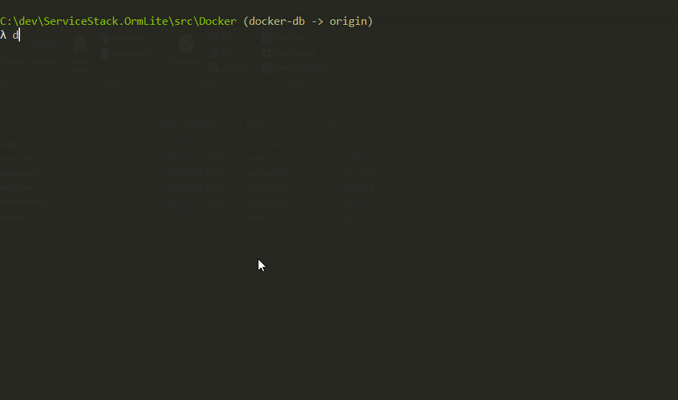

# Docker database server instances for testing

This directory contains a docker compose file that can be used to create database server instances for running tests that do not support embedded instances. The list of db servers created is below.

To use, you must first have docker and docker compose installed.

## To spin up all the database servers, run the following

```bash
$> docker-compose up -d
```

## To remove/teardown the database servers, run the following

```bash
$> docker-compose down
```

## Database servers created

|Database|Version|Port|DbName|DbUser|DbPwd|
|--------|-------|----|------|------|-----|
|Firebird|3.0.4|48101|test|test|test|masterkey|
|MySql (mariaDb)|5.5.x|48201|test|root|test|
|MySql (mariaDb)|10.1.x|48202|test|root|test|
|MySql (mariaDb)|10.2.x|48203|test|root|test|
|MySql (mariaDb)|10.3.x|48204|test|root|test|
|MySql (mariaDb)|10.4.x|48205|test|root|test|
|Postgres|9.x|48301|test|test|test|
|Postgres|10.x|48302|test|test|test|
|Postgres|11.x|48303|test|test|test|
|Oracle XE|11.x|48401|SID: xe|system|test|
|MS SQL Server Express|2019.x|48501|master|sa|Test!tesT|

## What it looks like in action...

