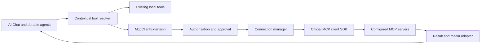

# MCP Client Support for AI.Chat

**Status: implementation with release-validation work remaining.** The client, contextual tools,
shared approval dispatch, encrypted OAuth records/callbacks, network policy, invocation journal and C#
UI are implemented. See [MCP_CLIENT_USER.md](MCP_CLIENT_USER.md) for the implemented configuration,
limits and tested compatibility matrix. The acceptance gates below remain the release checklist;
implementation does not imply every interoperability, dialect, restart or load gate has passed.

### SDK compatibility spike (2026-09-27)

Selected stable `ModelContextProtocol.Core` **2.2.0** and `JsonSchema.Net` **9.4.0**, pinned directly in
the project. Both support .NET 8; AI.Chat builds on net8.0 and net10.0. SDK APIs were compiled and
exercised through loopback JSON/SSE fixtures for `2025-06-18` and `2026-07-28`. The SDK also lists
`2024-11-05`, `2025-03-26`, and `2025-11-25`; those revisions are not individually certified here.
`HttpClientTransport` is explicitly Streamable HTTP; legacy fallback is off. `McpClient` and transport
use asynchronous disposal behind `IMcpClientSession`/factory.

OAuth uses `ClientOAuthOptions.AuthorizationCallbackHandler` (not the legacy code-only redirect
delegate), `AuthServerSelector` and `ITokenCache`. Tokens/callback responses are Data Protection
encrypted and stored in the configured ChatDb. The public SDK retains PKCE exchange state in memory:
callback transactions are durable, but restarting the initiating process requires a new sign-in.
Host-registered public PKCE clients are supported; dynamic registration is not enabled.

Source inspection found that even low-level SDK tool calls automatically continue `input_required`
responses. The HTTP policy guard explicitly rejects continuation parameters and repeat tool dispatch;
JSON/SSE fixtures verify no second call reaches the server. Sessions are operation-scoped rather than
pooled. Catalog snapshots remain partitioned/cached. Supported private media stays inline in owned
conversation results instead of entering the shared media cache. These are deliberate implementation
choices; review their overhead and UI behavior during the remaining release validation.

## 1. Goals and ownership

Enable AI.Chat conversations and durable agents to discover and invoke tools from configured Model Context Protocol (MCP) servers, alongside existing ServiceStack API tools and built-in tools.

Implement this as a **separate `McpClientExtension`**, with extension ID `mcp_client`, under `Extensions/McpClient`. Keep the C# backend in the `ServiceStack.AI.Chat` project. The existing `Extensions/Mcp` extension exposes this application's tools to external clients; the new extension consumes external servers. Each must work independently.

This feature originated in C# and is now ported to `llms-py` under `extensions/mcp_client`. Preserve the shared endpoint/JSON contracts and provider adapters. The shared UI source is `llms/extensions/mcp_client/ui`; `sync.sh` copies it verbatim into `chat/ext/mcp_client`. Use `./sync.sh --extension mcp_client` for a focused sync. Python keeps stdlib/aiohttp transport and SQLite storage; C# keeps the MCP SDK, OrmLite and ASP.NET Data Protection.

The first complete release should provide:

- Multiple host-configured remote MCP servers over Streamable HTTP.
- Host-managed credentials and connections authorized separately by each signed-in user through OAuth.
- Discovery, selection, approvals, execution, structured results, and supported media inside AI.Chat.
- User-scoped tool catalogs and connection status, including durable-agent execution.
- A C# UI extension for connections, tools, authentication, and troubleshooting.
- Explicit limits, cancellation, diagnostics, and safe recovery from connection failures.

Implement on the project's existing `net8.0;net10.0` targets using one code path where the chosen SDK permits it. Confirm SDK compatibility before introducing dependencies; do not silently remove .NET 8 support from AI.Chat. Local stdio support is a subsequent, explicitly enabled milestone. Legacy HTTP+SSE, prompts/resources browsing, sampling, elicitation, MCP Apps, and MCP Tasks are later capabilities, not first-release requirements.

## 2. Current code and required integration work

| Existing code | Current behavior | Planned integration |
| --- | --- | --- |
| `ChatFeature.cs`, `Hosting/ChatExtension.cs` | Installs extensions synchronously; loads them concurrently | Add an independently disabled `McpClientExtension` and `ChatFeature.McpClient` accessor; register local services during install and connect lazily |
| `Hosting/ExtensionContext.cs` | Registers protected routes, tools, UI extensions, and synchronous shutdown callbacks | Add contextual tool-provider registration and asynchronous cleanup support |
| `Extensions/Tools/ToolsExtension.cs` | Owns global mutable `Tools`/`Groups` dictionaries; resolves selectors without user context | Add a contextual resolution layer without putting remote tools into these dictionaries |
| `Pipeline/ToolRegistry.cs` | Defines `ChatTool`; `ToolRegistry` itself is currently empty | Extend the existing abstractions deliberately; do not assume a contextual registry already exists |
| `Pipeline/ChatOrchestrator.cs` | Injects static tools, performs approval preflight, executes tools, and converts results | Resolve a per-turn catalog; enforce the same selection and policy at invocation; preserve complete execution context |
| `Pipeline/ChatContext.cs` | Carries identity, request, cancellation, thread/run information, and execution items | Add typed tool-resolution/execution state and a supported child-context creation method |
| `Pipeline/ToolApproval.cs` | Provides generic approval contracts | Retain the contracts and implement source-aware approval execution |
| `Extensions/ApiTools/ApiToolApprovals.cs` | Persists generic-looking approval rows, but approve execution calls `apiTools.GetTool/ExecuteAsync` directly | Generalize execution through registered adapters; retain existing API approval behavior and routes |
| `chat/custom/ApiApprovalForm.mjs` | Uses API-specific labels, routes, and tool-call rendering | Preserve existing API UI; add MCP rendering through the new extension, backed by common approval services |
| `Extensions/App/AppDurableAgents.cs`, `Db/ChatDbDurable.cs` | Persist and resume agent work | Persist remote invocation identity and approval state; reconstruct clients and reauthorize on resume |
| `Extensions/Mcp/McpExtension.cs` | Exposes selected local tools through `/chat/mcp` | Keep imported tools excluded from inbound MCP exposure |
| `sync.sh` | Preserves C# `identity` and `credentials` UI directories | Preserve `mcp_client` against both overwrite and stale-directory deletion |

Two execution details require specific fixes. `ExecToolAsync` currently overwrites a declared `user` argument with the authenticated username; this convention must remain local-tool behavior and must not rewrite remote MCP arguments. It also creates a reduced `ChatContext`, dropping items and run/step metadata. Replace that ad hoc copy with a child context carrying trusted identity, cancellation, tool selection, approval state, and diagnostic correlation.

## 3. SDK and protocol strategy

Use the official C# SDK's **`ModelContextProtocol.Core`** package, which supplies client APIs with the smallest SDK dependency surface. Keep SDK types inside `Extensions/McpClient`; continue using AI.Chat's JSON tool contracts and provider pipeline. There is no need to adopt `IChatClient`, add an MCP ASP.NET Core server package, or replace the existing MCP server. [Official SDK package guidance](https://github.com/modelcontextprotocol/csharp-sdk#packages)

Add the pinned package reference to `ServiceStack.AI.Chat.csproj`, following repository version conventions. A disabled runtime extension still adds this transitive package dependency; a separately distributed NuGet assembly is a possible future packaging decision, not required by the extension boundary.

Before implementation, run a small SDK compatibility spike and record the selected stable version, target frameworks, supported protocol revisions, OAuth APIs, and disposal behavior in this document. Wrap SDK calls in an internal `IMcpClientSession`/factory seam so tests can supply controlled clients and later SDK changes do not spread through AI.Chat.

### Protocol compatibility is version-aware

The published `2026-07-28` revision replaces connection-level initialization/session assumptions with per-request protocol metadata and introduces multi round-trip requests. Earlier servers use the initialize handshake and can use HTTP session IDs. Let the pinned SDK implement negotiation and version-specific transport behavior; do not write a new JSON-RPC transport or assume every server has a session. [Protocol changes](https://github.com/modelcontextprotocol/modelcontextprotocol/blob/main/docs/specification/2026-07-28/changelog.mdx)

Target current stable protocol support plus the earlier revisions the selected SDK officially supports. Test compatibility with the existing ServiceStack MCP server as one fixture. If the chosen stable SDK lacks a revision, publish the actual compatibility matrix and reject unsupported versions clearly instead of claiming universal compatibility.

For the initial release:

- Explicitly select Streamable HTTP instead of automatic fallback to legacy SSE.
- Support JSON responses and streaming responses through the SDK, including its version-specific lifecycle.
- Advertise only implemented client capabilities. Sampling, roots, elicitation, and optional extensions remain disabled.
- Treat an unsupported capability or multi-round-trip input request as an actionable unsupported-operation result. Do not turn it into success, automatically approve it, or replay the call.
- Do not infer protocol support from a server's display name or an HTTP 200 response.

The SDK already exposes HTTP and stdio transports; use these implementations behind the adapter. [SDK transport documentation](https://csharp.sdk.modelcontextprotocol.io/v2/concepts/transports/transports.html)

## 4. Proposed configuration and public surface

Add `McpClientExtension` to the built-in extension list with `Disabled = true`. Enabling it with no servers should show an empty connection panel and make no outbound connections. Disabling it must remove its routes/UI/tool provider and stop any owned background work.

Example of the **proposed configuration API**:

```csharp
Plugins.Add(new ChatFeature {
    McpClient = {
        Enabled = true,
        Servers = {
            new McpClientServer {
                Id = "knowledge",
                DisplayName = "Company Knowledge",
                Endpoint = new Uri("https://knowledge.example.com/mcp"),
                Auth = McpClientAuth.HostSecret("knowledge-mcp-token"),
                RequiredRoles = ["Employee"],
                AllowedTools = ["search", "read_document"],
                Approval = McpClientApproval.Always,
            },
            new McpClientServer {
                Id = "work",
                DisplayName = "My Work Tools",
                Endpoint = new Uri("https://work.example.com/mcp"),
                Auth = McpClientAuth.UserOAuth(),
                AllowedTools = ["search_issues", "create_issue"],
                Approval = McpClientApproval.Always,
            },
        },
    },
});
```

`HostSecret` stores a reference resolved by a host-provided `IMcpClientCredentialStore`; it must not serialize a token into configuration sent to browsers. `UserOAuth` uses a per-user authorization record. These helper names are design proposals, not SDK APIs.

### Configuration rules

- `Id` is a unique, immutable, host-assigned identifier; changing an endpoint or authentication mode increments a configuration revision and invalidates cached clients and approvals.
- Validate duplicates, malformed endpoints, reserved aliases, and inconsistent settings locally during installation. Record a disabled/error state if extension initialization fails; the current host logs extension errors, so do not assume an exception necessarily stops the application.
- Initial server definitions are host-owned. The UI lets users connect/disconnect and select tools from approved definitions; it does not let ordinary users add arbitrary outbound URLs or executable commands.
- Require an explicit tool allowlist; an explicit `"*"` can enable all discovered tools for hosts that want that behavior. An empty allowlist exposes nothing. Deny rules always win.
- `RequiredRoles` is a coarse connection gate. Add a host callback for application-specific authorization using the current authenticated request and operation (`discover`, `invoke`, `connect`). Apply it at both discovery and execution.
- Default all imported tools to approval required. Hosts may explicitly allow specific tools to run without prompting; a remote read-only annotation alone cannot authorize this.
- Host-managed shared credentials require an explicit audience/access policy. Display that the connection uses an application account rather than the user's account.
- `RequireAuth = false` requires an explicit single-user MCP mode with a stable default partition. OAuth and connection mutation are disabled otherwise; `ExtensionContext.IsAdmin` alone is insufficient because it returns true when authentication is disabled.

### Initial configurable limits

Start with conservative defaults and tune using compatibility tests: 15-second connection/discovery timeout; 60-second tool-call timeout bounded by `Tools.ToolTimeout`; 4 active calls per principal/connection; 16 per connection across the process; bounded queues with cancellation; 256 imported tools per connection; 100 catalog pages; 64 KiB per schema; 1 MiB aggregate catalog; 4 MiB aggregate call response; and 5-minute catalog freshness. Allow host overrides within global ceilings. Define limits in bytes before parsing/base64 decoding as well as after decoding, and bound JSON depth and description length.

## 5. Architecture and lifecycle



Proposed extension components:

| Component | Responsibility |
| --- | --- |
| `McpClientExtension` | Configuration, lifecycle, routes, UI registration, contextual provider registration |
| `McpClientConnectionManager` | Client leases, connection states, concurrency, authentication revisions, shutdown |
| `McpClientCatalog` | Bounded discovery, validation, immutable snapshots, alias mapping, refresh |
| `McpClientToolProvider` | User-scoped selection and invocation lookup |
| `McpClientInvoker` | Final authorization, argument validation, approval checks, SDK invocation |
| `McpClientResultMapper` | Text/structured/media/error conversion |
| `McpClientApprovalExecutor` | Durable approval dispatch and revalidation |
| `McpClientOAuthService` | Authorization transactions, callbacks, token refresh, disconnect |
| `IMcpClientCredentialStore` | Secret resolution and encrypted per-user credential persistence |
| `McpClientDiagnostics` | Safe status, metrics, tracing, and audit events |

`Install` registers these components and routes without contacting remote servers. `LoadAsync` may warm host-scoped catalogs but must not depend on another extension's load order or hold up chat startup waiting for unreachable services. User connections are established lazily.

Key client leases, authentication state, and catalogs by host/configuration identity, server ID, principal partition, credential revision, and applicable authorization scope. Do not share a client with user-specific headers between users. Initially keep catalogs partitioned even when a server labels its catalog public; optimization can follow isolation tests.

Use one in-flight creation/refresh task per key and reference-count active leases. Configuration changes, disconnect, credential rotation, and policy changes block new calls immediately, invalidate cached definitions, and retire the old client after bounded draining/cancellation. Evict idle clients with a configurable TTL and cap total cached clients. Never hold request objects for the life of a connection.

Connection states should include `disconnected`, `connecting`, `ready`, `auth_required`, `degraded`, `disabled`, and `unsupported`. Expose sanitized errors and last successful discovery time. Remote downtime must not prevent local tools or other MCP servers from functioning.

Extend shutdown registration to support asynchronous handlers and cancellation, using host lifetime integration on both supported targets. Cancel active work, stop refresh tasks, await SDK disposal within a bounded timeout, and retain compatibility with existing synchronous shutdown handlers. Avoid fire-and-forget disposal or indefinite blocking from the current `Action` callback.

## 6. Contextual tool discovery and selection

### Resolution contract

Introduce an additive `IChatToolProvider` abstraction with asynchronous resolution using `ChatContext`. `ToolsExtension` becomes the coordinator for static local tools and registered contextual providers. Keep current synchronous APIs working for existing static callers; migrate all execution entry points to the contextual APIs.

Create an immutable `ResolvedChatTools` snapshot per model turn containing definitions, stable invocation handles, provenance, authorization/configuration revisions, and schema hashes. Store it in typed context state and propagate it into child calls. Do not mutate `ToolsExtension.Tools` while requests enumerate it.

Update these paths together:

1. `CreateChatWithTools`: add an asynchronous contextual overload used by the orchestrator. Merge only definitions from authorized, selected tools. Preserve existing structured-output behavior.
2. Approval preflight: resolve the tool from that same snapshot.
3. `ExecToolAsync`: require a selected handle for model-originated calls. Recheck current access before execution; the snapshot is not an authorization grant.
4. `/ext/tools` listing: return only the calling user's tools and groups while preserving its existing response fields.
5. `/ext/tools/exec/{name}`: use contextual lookup and the same invocation policy. A direct request cannot bypass approvals or rewrite remote arguments using the local route's top-level property filtering.
6. Durable-agent and approval continuation paths: reconstruct the principal and verify the persisted handle against current policy rather than falling back to global lookup.

For direct calls outside a chat turn, create a fresh authorized snapshot with the explicitly requested tool. If interactive approval is needed but no durable approval context exists, return `approval_required` without contacting the remote server. Untrusted tool definitions embedded in an incoming chat request must never register executable handlers or override an imported alias.

### Naming and schemas

- Group tools under `mcp_<serverId>`. Use deterministic aliases such as `mcp_work_search_issues`, restricted to a conservative provider-compatible character set and length (initial ceiling 64 characters).
- Resolve normalization/truncation collisions with a stable hash of configured server ID plus exact remote tool name. Store the reverse mapping; never recover the remote name by splitting an alias. Detect collisions with local names before publishing the catalog.
- Do not use server-reported names as identity. Preserve exact case-sensitive remote tool names in invocation handles.
- Keep the original input/output schemas separately from provider-facing definitions. Validate arguments against the original schema before sending them. Preserve nested objects, arrays, enums, nullable fields, and required properties; do not turn all inputs into strings.
- Use a bounded JSON Schema validator compatible with the selected protocol's schema dialect, with remote `$ref` fetching disabled. Resolve supported local `$defs` references; exclude unsupported schemas with a visible reason. Assess any additional validator package explicitly during the SDK spike.
- Provider schema adaptation may change representation only when equivalent. If a provider cannot express a schema, disable that tool for that model with an explanation. Do not silently weaken validation or modify the remote operation.
- Preserve structured output as a JSON value, including arrays and scalars where allowed by the negotiated revision. Validate against an advertised output schema; report invalid output without losing its diagnostic context.

The MCP tool specification supports paginated discovery, authorization-dependent catalogs, structured results, and annotations that clients must treat cautiously. The adapter should retain these distinctions. [MCP tools specification](https://modelcontextprotocol.io/specification/2026-07-28/server/tools)

### Refresh and model budgets

Follow pagination under total page/byte/tool limits; detect repeated cursors. Publish a complete validated snapshot atomically. Invalid individual tools can be omitted with diagnostics; an incomplete refresh must not replace the active catalog as if it were complete.

Refresh on user request, bounded expiry, authorization/configuration change, and supported list-change notifications. Use SDK facilities appropriate to the negotiated revision. Do not rely on notifications being available. A failed refresh may leave a visibly stale cached description, but execution must still satisfy current policy and connection availability.

`none` selects no tools. Explicit MCP group/alias selectors opt in to remote tools. For compatibility, plain `all` continues to select local tools by default; add `IncludeInAll` per server for hosts that deliberately want remote tools included. Document this choice in configuration and UI.

Apply a per-model definition/token budget after selection. If selected tools exceed it, ask the user to narrow groups or use a later search/describe workflow; do not silently select an arbitrary subset. Keep ordering deterministic to stabilize prompts and provider caches.

## 7. Execution, results, and failure semantics

For each call:

1. Resolve the immutable handle and verify server/tool selection, principal access, current configuration, and credential scope.
2. Validate the effective arguments against the original schema and applicable payload limits.
3. Check the local approval decision for this exact principal, tool, schema/configuration revision, and argument set.
4. Acquire a bounded concurrency lease and a client lease using linked request/agent, deadline, and shutdown cancellation.
5. Invoke the exact remote name through the SDK; emit safe start/completion diagnostics.
6. Convert the full result into AI.Chat content/resources and persist the tool-call outcome before continuing the conversation.

Never attach the host's incoming bearer token, session cookie, or API key to an outbound call automatically. Do not inject a `user` argument into MCP tools. Do not let a model choose a connection URL, credential reference, or protocol header through ordinary tool arguments.

### Result mapping

| Remote result | AI.Chat behavior |
| --- | --- |
| Text content | Preserve order as tool text, applying configured size limits |
| `structuredContent` | Preserve separately in the execution envelope; expose one useful JSON representation to the model without duplicating an equivalent text fallback |
| Images/audio | Validate MIME type, decoded size, and filename; adapt to the existing `image`/`audio` resource path and capability checks |
| Embedded resource text/blob | Convert bounded text or supported media/files, retaining source URI as provenance |
| Resource link | Show a labeled reference; do not automatically download arbitrary URLs or imply it is already attached |
| Unknown content type | Return an explicit unsupported-content description with safe metadata |
| `isError` tool result | Record an execution error visible to the model and UI; preserve useful sanitized remote text |
| Protocol/transport/auth error | Use distinct error categories and reconnect/sign-in guidance; never present as a successful empty result |

Introduce an internal result envelope carrying structured data, ordered content blocks, resources, remote error status, and provenance. Adapt it at the existing tuple/message boundary without replacing the public chat wire format. Tool call IDs and media must survive durable persistence and approval continuation.

Check existing media storage URLs before using them for sensitive remote output. Require authenticated, owner-scoped retrieval or suitably scoped signed access, enforce retention and deletion, and do not write remote data to a publicly browsable cache. Any necessary media-boundary fix is a release gate.

### Retries, cancellation, and durable work

- Retry bounded discovery/connection setup for transient failures with backoff and jitter. Respect rate-limit guidance without holding unbounded queues.
- Do not automatically replay a dispatched `tools/call`, even when reconnecting, refreshing a token, or recovering a durable agent. A timeout or lost response can mean the remote operation completed.
- Retry an operation only when there is a verified server-specific idempotency contract and the same operation key can be reused. Remote read-only/idempotency hints alone are insufficient.
- Track `prepared`, `approved`, `dispatched`, `completed`, `failed`, and `outcome_unknown` states where durable execution is involved. On crash after dispatch, surface uncertainty and require reconciliation rather than running it again.
- Propagate cancellation through SDK calls and queue waits. Cancellation stops local waiting; it cannot guarantee rollback of remote effects. Canceling a thread invalidates outstanding approval decisions.
- On restart, restore identifiers and credential references, never serialized SDK clients or request objects. Reauthorize background execution against current account/policy state. If that cannot be established, pause for the user.
- Use atomic claims for approval execution across application instances. Persist a unique invocation ID and outcome; retain the limitation that local bookkeeping cannot guarantee exactly-once remote execution.

## 8. Approval integration

Use AI.Chat's interactive approval system for outbound tool calls. The inbound MCP server's signed confirmation-token protocol remains a separate boundary; registering an MCP client must not change that behavior.

The existing `IChatToolApprovalCoordinator` abstraction is reusable, but `ApiToolApprovalCoordinator.ApproveAsync` is API-specific. Generalize the implementation as follows:

1. Add a source-aware approval executor registry in the C# pipeline, with `api_tools` and `mcp_client` adapters.
2. Extend approval persistence additively with `Source`, versioned source metadata, title, invocation ID, server/tool identity, schema/configuration hash, and credential-binding revision. Existing rows with no source resolve as `api_tools`.
3. Keep existing tables, API routes, field compatibility, ownership checks, batch ordering, rejection, and thread continuation behavior. Move generic execution to the shared service and preserve API execution in its adapter.
4. Register the common service when either API tools or MCP client tools need it. MCP approvals must work when `ApiToolsExtension` is disabled. Avoid competing assignments to `Feature.ToolApprovalCoordinator`.
5. Expose MCP approval routes backed by the same service. A single batch may contain API and MCP calls; list and continue it through the common service so neither UI renderer resumes the thread prematurely.
6. Store server identity, exact tool name, full schema, proposed arguments, and a human-readable action summary. Recheck endpoint identity and current access when the user approves. A changed tool/schema/endpoint requires a new approval.
7. Validate user-edited arguments, store the exact effective arguments, and dispatch only those arguments. Material changes to connection identity or policy cannot be approved through argument edits.
8. Represent approval as server-side state tied to the owned invocation. An `approved: true` model argument or arbitrary context item cannot grant execution. Enforce the decision inside the invoker, including direct execution routes.

Initially default to per-call approval. Host policy may bypass prompts for explicitly reviewed tools. Unknown/destructive tools require confirmation or can be denied entirely. Approval screens show the remote server, account scope, tool, data being sent, and editable arguments. Never ask users to put credentials into tool-argument approval forms.

For a remote ServiceStack MCP server, its custom two-phase confirmation result is not generic MCP approval. The initial client should show the remote confirmation requirement and must not automatically redeem tokens merely because a local approval occurred. A future opt-in adapter can map that flow with explicit binding and tests.

## 9. Authentication, persistence, and outbound access

### Credential storage

Host secrets are resolved through the host's configured secret store. Persist user OAuth credentials encrypted through an `IMcpClientCredentialStore` implementation; an OrmLite implementation may use ASP.NET Core Data Protection with a dedicated purpose and host-managed shared keys for multiple instances.

Scope credential records by owner/tenant partition where applicable, server/configuration identity, canonical resource, authorization issuer, and granted scopes. Persist refresh tokens with revision/concurrency protection. Never put secrets in `providers.json`, `llms.json`, user preference JSON, chat messages, approval metadata, logs, or browser storage.

Add connection/auth tables through the project's additive schema pattern and `NamedConnection`. Keep normal discovery snapshots in memory; persisted approval/invocation records retain the schema needed for review and recovery. Include migration/backfill tests on supported OrmLite dialects and integrate any extension-owned tables with schema initialization and teardown.

Define disconnect and deletion separately: disconnect disables use and retires clients; credential deletion removes local tokens and attempts remote revocation only where supported. User deletion must remove owned credentials and pending authorization transactions. Use existing thread retention for message history rather than deleting unrelated conversations.

### Browser-based OAuth

Use the official SDK's OAuth support behind an AI.Chat adapter. This is a web application: do not copy a desktop sample that launches the server machine's browser or starts a loopback listener. Persist a short-lived authorization transaction and return a browser navigation URL; complete it through a protected, configured callback route.

Implement authorization code with PKCE, protected-resource/authorization-server metadata discovery, resource binding, scope management, issuer-bound client registration, and token refresh according to the selected protocol revision. Validate returned issuer information where required. Prefer host-provided client registration first, and support protocol-defined registration mechanisms only after validating them against the pinned SDK. [MCP authorization specification](https://github.com/modelcontextprotocol/modelcontextprotocol/blob/main/docs/specification/2026-07-28/basic/authorization/index.mdx), [SDK OAuth options](https://csharp.sdk.modelcontextprotocol.io/v2/api/ModelContextProtocol.Authentication.ClientOAuthOptions.html)

Bind state and PKCE verifier to principal, browser authorization transaction, server ID, expected issuer/resource, redirect URI, and expiry. Enforce one-time callback consumption and exact redirect matching. Derive callback URLs from trusted host configuration, not arbitrary forwarded headers. Refresh credentials under a per-record distributed/optimistic concurrency guard; expired or revoked credentials transition to `auth_required`.

All connection mutation routes use existing host authentication/authorization plus CSRF protection for cookie-based requests. OAuth state validation is additionally required at the callback. Reauthentication may resume a pending authorization flow only for its original owner. Keep authorization codes and callback query strings out of logs.

### Outbound network policy

Apply one host-controlled outbound policy to server endpoints, redirects, OAuth metadata/token/registration endpoints, icons, and any later resource fetching. Validate schemes, authority, ports, DNS results, and the actual connection destination; reject loopback, link-local/cloud metadata, and private networks unless explicitly allowed by deployment policy. Protect against DNS rebinding and IPv4/IPv6 alternate representations. Enterprise private MCP servers can be allowlisted deliberately.

Disable automatic redirects initially or validate every hop and strip credentials when authority changes. Restrict proxies through host configuration and retain normal TLS certificate validation. Never pass through arbitrary host auth headers. Escape server descriptions and errors in UI; do not render remote HTML, fetch icons automatically, or promote server instructions into trusted system instructions. These controls apply during discovery as well as tool execution. [MCP security guidance](https://modelcontextprotocol.io/docs/2026-07-28/tutorials/security/security_best_practices)

## 10. C# UI and management endpoints

Edit `llms/extensions/mcp_client/ui/index.mjs` and its sibling components/styles upstream, then sync into `chat/ext/mcp_client`. Register them through `RegisterUiExtension` and existing menu/component hooks. C# assets must survive `sync.sh`: keep `mcp_client` out of `KEEP_EXT` and `SKIP_EXT` so its upstream UI is copied verbatim. Exercise synchronization against a temporary fixture; do not run the production sync script as a documentation validation step.

Provide:

- **Connections:** approved server names, account mode, status, sign-in/disconnect, refresh tools, and actionable sanitized errors.
- **Tools:** per-server groups, descriptions, schema viewer, approval requirement, available/unavailable reasons, and conversation selection. Preserve current local-tool selection behavior.
- **Approvals:** an MCP-specific renderer using common approval DTOs and source identity. Show edited values and approval outcome; preserve mixed-batch ordering and continuation.
- **Tool results:** remote-server provenance, duration, structured output, media, cancellation, and uncertain outcomes. Users can distinguish a tool error from a connection problem.
- **Host administration:** policy/status views guarded by real host permissions. Initially edit endpoints and service credentials in host configuration rather than adding an unrestricted URL editor.

Proposed routes, relative to `{RoutePrefix}/ext/mcp_client`:

| Method and route | Purpose |
| --- | --- |
| `GET /connections` | Current user's permitted servers and sanitized connection state |
| `GET /connections/{id}/tools` | Current user's validated catalog and selection metadata |
| `POST /connections/{id}/refresh` | Bounded rediscovery under current identity |
| `POST /connections/{id}/connect` | Start an OAuth transaction or connect using configured credentials |
| `GET /oauth/callback` | Validate and complete the browser authorization transaction |
| `POST /connections/{id}/disconnect` | Disable the user's binding and retire clients |
| `DELETE /connections/{id}/credentials` | Delete the user's stored authorization |
| `GET /approvals/{threadId}` | Owned approval batch state through the shared coordinator |
| `POST /approvals/{id}/approve` | Validate, claim, and execute an owned MCP approval |
| `POST /approvals/{id}/reject` | Reject an owned approval |

Return consistent ServiceStack error shapes and machine-readable reason codes. Management routes must never return raw headers, tokens, internal exception stacks, or credentials belonging to another user. Do not add an unrestricted `tools/call` proxy route. Authenticated read-only listing remains bounded to avoid remote discovery abuse.

## 11. Diagnostics and deployment behavior

Emit structured lifecycle/discovery/invocation/approval events with server ID, local tool alias, invocation ID, protocol revision, elapsed time, result category, and correlation IDs. Keep full endpoints, usernames, arguments, results, and credentials out of metric dimensions. Disable payload logging by default and apply host redaction to any opt-in diagnostic capture.

Use `ActivitySource` and `Meter` consistent with the planned ServiceStack OpenTelemetry work; this feature must also function without an exporter. Add low-cardinality duration/error/active-call/catalog-refresh measurements. Coordinate SDK and HttpClient instrumentation to avoid redundant spans, and do not propagate inbound baggage or trace headers to third-party servers without a host policy.

Follow the correlation and compatibility contracts in [OPEN_TELEMETRY.md](../ServiceStack/OPEN_TELEMETRY.md). If MCP diagnostics introduce new entries or fields in Admin Profiling, update both `../ServiceStack/modules/admin-ui/components/Profiling.mjs` and `../../tests/NorthwindAuto/admin-ui/components/Profiling.mjs` together. Verify remote-tool labels, durations, failures, and trace links in both copies while preserving existing rows and redaction. Emitting an Activity alone does not make it appear in the local profiler; explicitly define and test the bridge if local MCP profiling is included.

Health checks report individual connections as degraded without making the whole application unready by default. Bound failure backoff and manual refresh rates. In multiple-instance deployments, keep clients local, share durable approvals and encrypted credentials, and use database revision checks or invalidation messages so revocation takes effect before another call. Document that per-process concurrency limits are not a distributed quota.

## 12. Later capability milestones

### Local stdio servers

Add a separate disabled `EnableStdio` option and host-only definitions for executable, argument array, working directory, environment allowlist, identity scope, and process lifetime. The process runs on the application server, not the browser user's computer; state this clearly in the UI and documentation.

Use the SDK transport with no shell expansion and environment inheritance disabled. Require preinstalled/pinned executables; do not run package installation commands supplied by users or models. Starting a process is a distinct host execution permission from granting a remote tool. Use per-principal processes unless the host explicitly configures a shared service identity, with process-count/memory controls supplied by deployment isolation, bounded stderr, graceful shutdown, and forced child-process cleanup. Tool approval does not sandbox a malicious server process.

### Resources and prompts

Add explicit user-driven resource browsing/reading and prompt selection after tool support is stable. Bind `resources/read` to the configured connection and URI; a URI is not automatically an HTTP URL to fetch. Apply per-user authorization, size limits, and provenance. Require user intent before adding a remote prompt to a conversation, and keep it below system/developer policy. Implement supported list/read/template operations and cache invalidation as a separate tested capability.

### Server-requested interaction and other transports

Sampling, elicitation, roots, MCP Tasks, and MCP Apps each need their own consent, lifecycle, budget, and UI design. Do not advertise them until implemented end to end. Sampling must never automatically spend provider credentials; roots must never reveal host paths by default. Add legacy SSE only for a demonstrated compatibility requirement using SDK support and the same auth/network policies. Re-exporting imported tools through `/chat/mcp` is a separate gateway feature requiring explicit authorization, recursion controls, and approval semantics.

## 13. Implementation sequence and acceptance gates

### Phase 1 — SDK spike and isolated extension

- Pin and verify the SDK, schema validator, framework compatibility, version negotiation, web OAuth integration seam, result representation, and disposal.
- Add disabled extension/configuration, fake client adapter, validated host server definitions, network policy, lifecycle manager, and async cleanup integration.
- Add one loopback fixture server covering JSON and streaming HTTP responses.
- **Gate:** enabling/disabling the extension is deterministic; disabled means no routes, UI, clients, or outbound calls; remote failure does not block startup.

### Phase 2 — Contextual tools and basic invocation

- Add contextual provider/resolution APIs and migrate orchestrator, tools listing, direct execution, and agent entry points.
- Implement bounded catalog discovery, aliases, original/provider schemas, selection, host-secret credentials, safe read-only test calls, and result mapping.
- Keep default approval-required calls blocked until Phase 3 is complete.
- **Gate:** two users with different permissions see and invoke different catalogs; guessed aliases and forged tool definitions cannot execute unauthorized tools; local-tool regression tests pass.

### Phase 3 — Shared approvals and durable execution

- Extract source-aware approval execution; add the API adapter and MCP adapter, additive migrations, mixed batches, and effective-argument validation.
- Implement invocation state persistence, reauthorization on resume, atomic claims, cancellation, and unknown-outcome handling.
- **Gate:** API approvals remain compatible, MCP approval works without API Tools enabled, direct calls cannot bypass prompts, and restart never silently replays a dispatched mutation.

### Phase 4 — OAuth and user interface

- Add encrypted credentials, browser authorization transactions, callback validation, refresh, disconnect/delete, and multi-instance revision handling.
- Add the C# connection/tool/approval/result UI and sync preservation.
- **Gate:** users can authorize separate remote accounts, select a tool, inspect/edit/approve a call, and see its result; cross-user access and credential leakage tests pass.

### Phase 5 — Compatibility, operations, and release

- Complete protocol/provider/media/schema compatibility, network-security tests, limits, lifecycle fault injection, diagnostics, and end-to-end browser tests.
- Add usage/configuration examples and the tested transport/auth/protocol matrix to README and a client guide. Link from `MCP.md` and `AGENTS.md` without changing the server's documented behavior.
- **Gate:** all first-release goals pass on net8.0/net10.0 and relevant persistence dialects; no Python/shared UI changes are needed; package and asset publication include the extension.

Phase 6 implements stdio and subsequent capabilities independently after the first release. OAuth and approvals are part of the complete remote-client release, not optional work left behind after a token-only prototype.

## 14. File and test plan

### Planned file ownership

| Files | Change |
| --- | --- |
| `Extensions/McpClient/*.cs` | New client extension, configuration, SDK adapter, connection manager, catalogs, invoker, result mapping, OAuth/credential services, approval executor, diagnostics |
| `ServiceStack.AI.Chat.csproj` | Pinned SDK and any approved schema-validation dependency |
| `ChatFeature.cs`, `Hosting/ExtensionContext.cs` | Disabled default extension, accessor, provider registration, lifecycle support |
| `Extensions/Tools/ToolsExtension.cs` | Contextual selection/list/execute support with local compatibility |
| `Pipeline/ToolRegistry.cs`, `Pipeline/ChatContext.cs`, `Pipeline/ChatOrchestrator.cs` | Provider contracts, provenance, immutable resolution, child contexts, execution/result integration |
| `Pipeline/ToolApproval.cs`, new shared coordinator implementation | Source-aware approvals and executor dispatch |
| `Extensions/ApiTools/ApiToolApprovals.cs` | Retained API adapter/routes and additive approval schema migration |
| `Extensions/App/*`, `Db/*` as required | Durable invocation state, ownership, crash recovery, schema lifecycle |
| `chat/ext/mcp_client/*`, `sync.sh` | C# UI registration, components, styles, and preservation |
| `Extensions/Mcp/McpExtension.cs` only if necessary | Explicit exclusion of contextual imported tools; preserve server behavior |
| `README.md`, `AGENTS.md`, `MCP.md`, client guide | Configuration, ownership, compatibility, and troubleshooting documentation |

Place focused tests in `../../tests/ServiceStack.AiTests`, following the existing AI.Chat and MCP test conventions. Prefer deterministic in-process fixture servers and a fake clock/client over external SaaS dependencies.

### Required test matrix

| Area | Cases |
| --- | --- |
| Configuration/lifecycle | Disabled/no servers, invalid config, concurrent load, failed server, reconnect storms, cancellation during discovery, idle eviction, disposal while calls are active |
| Protocol/transports | JSON/SSE responses over Streamable HTTP, supported older/current revisions, unsupported version/capability, session expiry where applicable, malformed frames, bounded streaming |
| Discovery | Pagination/cursor loops, duplicate/long names, collisions with local tools, invalid schema/header metadata, large catalogs, refresh/remove races, authorization-dependent lists |
| Isolation | Two users/accounts/tenants, credential rotation, role removal, shared host account policy, anonymous-mode gate, disabled connection, guessed direct-exec alias |
| Selection/providers | `none`, local `all`, explicit remote groups, `IncludeInAll`, context budgets, strict schemas, providers without tools/media, structured-output requests |
| Arguments/results | Nested schema validation, remote `user` parameter preserved, structured objects/arrays/scalars, mixed content order, unsupported content, invalid output, media ownership, oversize limits |
| Approvals | Default prompt, explicit host exemption, edited args, deny/cancel, stale schema/endpoint, replay/double click, mixed API/MCP batch, API Tools disabled, direct-route bypass attempts |
| Durable agents | Approval across restart, revocation while paused, crash before/after dispatch, lost response, unknown outcome, two workers claiming one invocation, safe continuation order |
| OAuth | PKCE/state/issuer/resource binding, callback replay, user switching, open redirects, expired/revoked tokens, concurrent refresh, disconnect/delete, encrypted persistence and redaction |
| Network policy | Private/metadata addresses, IPv6, DNS rebinding, redirects, malicious discovery URLs, icon/resource URLs, TLS failure, ambient header/cookie leakage |
| Diagnostics/UI | Correlation retained, no payloads/tokens in logs, sanitized errors, sign-in/out, selection, approval editing, results, screen-reader labels, sync preservation |
| Regression | Existing local API tools, API approval rows/routes, inbound MCP confirmation tokens, normal chat without extension, local execution context conventions |

Measure discovery and invocation overhead with realistic catalogs and concurrent principals. Verify bounded memory/client counts and prompt sizes. Publish configured defaults and tested limits rather than promising a fixed throughput figure.

## Feature Benefits

*Draft release-note copy for the completed first release.*

### Connect your AI assistant to more of your business

AI.Chat's new MCP client extension brings tools from your approved MCP servers into the same conversations as your ServiceStack APIs. Connect multiple services and let your assistant work with the tools your team already uses, without building a custom integration for each server.

### Choose the tools each conversation needs

Browse tools by connection, inspect what they do, and select the capabilities available to your assistant. Remote tools work through AI.Chat's existing model integrations, with clear availability when a model or server does not support a capability.

### Keep people in control of actions

Review the destination, tool, and arguments before an approved action runs. Edit inputs or reject a request from the chat UI, and let durable agents pause for your decision before continuing their work.

### Connect accounts with confidence

Use host-managed service connections or authorize your own account. Per-user access controls and protected credential storage keep each person's tools and permissions tied to their identity.

### See useful results and understand failures

Read structured results and supported media directly in your conversation, with clear connection details and actionable sign-in or connection errors. Interrupted calls with uncertain outcomes are surfaced for review, helping avoid accidental duplicate actions.

### Add MCP where you need it

Enable the dedicated extension in your C# AI.Chat application and configure the servers your team needs. The client and existing MCP server can be used independently, with no changes required to the upstream Python application.
