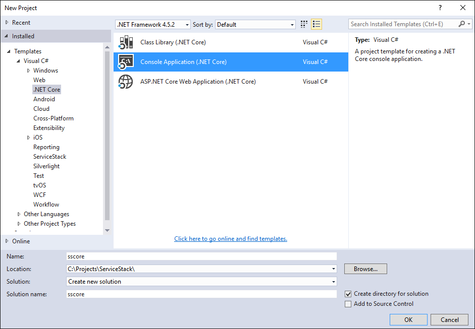
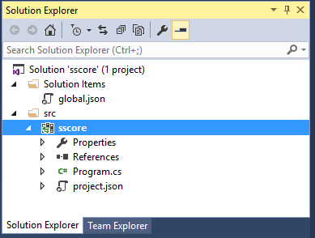
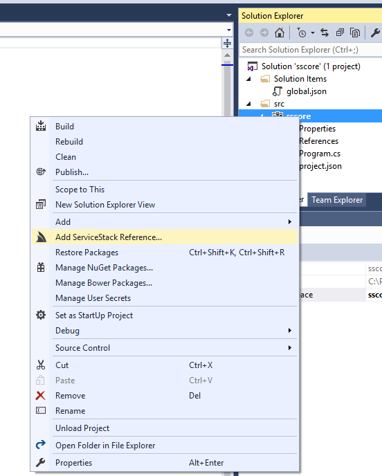
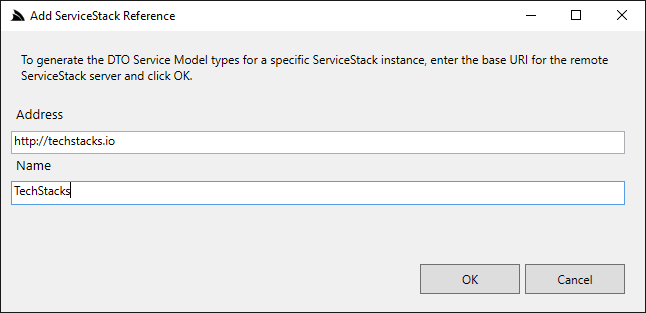
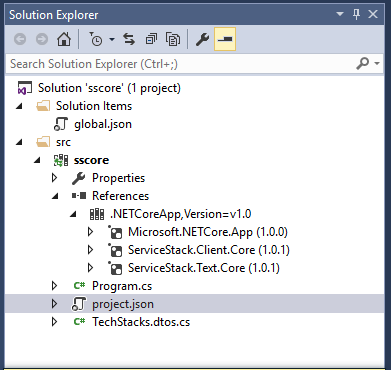
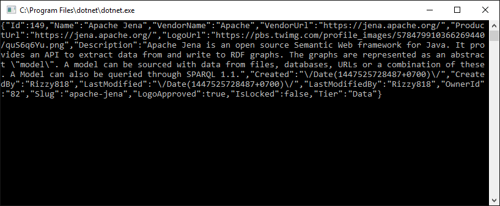
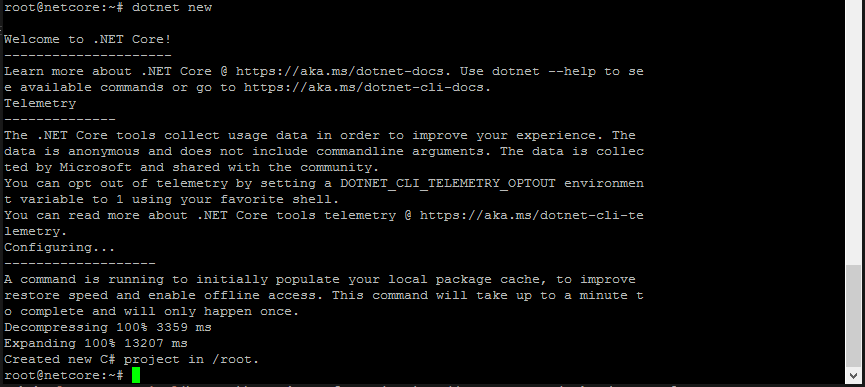
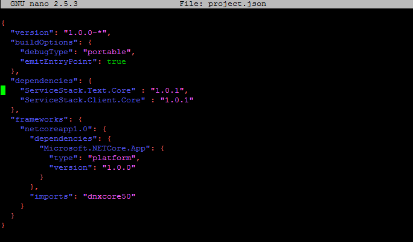
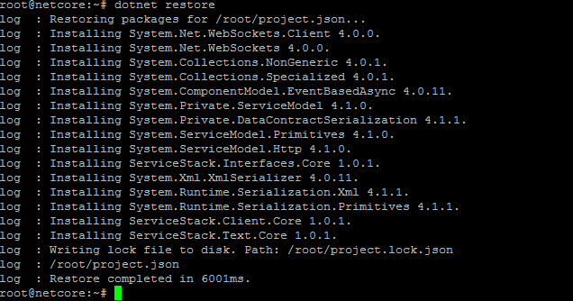
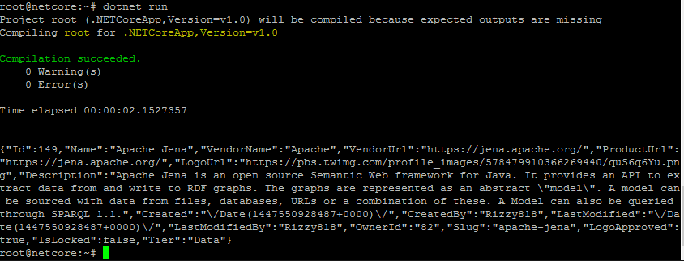

# Using ServiceStack.Client on .NET Core

This guide shows how to create and execute .NET Core console application which
uses ServiceStack.Client 

### Prerequisite [Install ServiceStackVS](https://github.com/ServiceStack/ServiceStack/wiki/Creating-your-first-project#step-1-download-and-install-servicestackvs)

### Install .NET Core                                                                                                                                                           
At the first step you need to install [Visual Studio 2015 update 3](https://go.microsoft.com/fwlink/?LinkId=691129)  and [.NET Core 1.0.0 - VS 2015 Tooling Preview](https://go.microsoft.com/fwlink/?LinkId=817245).
Also you need to install [ServiceStack Templates for Visual Studio](https://visualstudiogallery.msdn.microsoft.com/5bd40817-0986-444d-a77d-482e43a48da7).

To get more details about Visual Studio 2015 update 3 and .NET Core installation 
you can visit [.NET Core](https://www.microsoft.com/net/core#windows) site

### Create .NET Core Application

In Visual Studio click `File-> New-> Project` and select **.NET Core/Console Application (.NET Core)** 
from VS templates.



You will get following structure in Solution Explorer.



Right click on the project and select **Add ServiceStack Reference**



Then type in address field `http://techstacks.io` and `TechStacks` in name field and click **OK**.



You should get following project structure



And following `project.json` file


Then open file `Program.cs` and write the code

```csharp
using System;
using ServiceStack;
using ServiceStack.Text;
using TechStacks.ServiceModel;

namespace ConsoleApplication
{
    public class Program
    {
        public static void Main(string[] args)
        {
            var client = new JsonServiceClient("http://techstacks.io/");
            var response = client.Get(new GetAllTechnologies());

            //Print contents of the first technology to the Console
            response.Results[0].PrintDump();
        }
    }
}
```

Then hit "run" button **(F5)**. You should get following JSON output:



## Run ServiceStack.Client on Linux

### Install .NET Core

Suppose that you have ubuntu 16.04 installed (to see installation instructions for other OS you can 
visit [.NET Core site](https://www.microsoft.com/net/core)). Run commands in the console:

    sudo sh -c 'echo "deb [arch=amd64] https://apt-mo.trafficmanager.net/repos/dotnet-release/ xenial main" > /etc/apt/sources.list.d/dotnetdev.list'
    sudo apt-key adv --keyserver apt-mo.trafficmanager.net --recv-keys 417A0893
    sudo apt-get update
    sudo apt-get install curl dotnet-dev-1.0.0-preview2-003121

### Create Project

    dotnet new

This command will create `project.json` and `Program.cs` files in current folder.



Open `project.json` for edit:

    nano project.json

and edit empty `dependencies: {}` section add ServiceStack references:
    
    dependencies: {
        "ServiceStack.Text.Core" : "1.0.1",
        "ServiceStack.Text.Client": "1.0.1"
    }



type `Ctrl+X` to exit. Answer 'yes' to save changes in the file.

then open and edit `Program.cs` file. Type `nano Program.cs` and copy the code:

```csharp
using System;
using ServiceStack;
using ServiceStack.Text;
using TechStacks.ServiceModel;

namespace ConsoleApplication
{
    public class Program
    {
        public static void Main(string[] args)
        {
            var client = new JsonServiceClient("http://techstacks.io/");
            var response = client.Get(new GetAllTechnologies());

            //Print contents of the first technology to the Console
            response.Results[0].PrintDump();
        }
    }
}
```

Finally, download Techstacks CS types:

    curl -L http://techstacks.io/types/csharp -o TechStacks.dto.cs

### Run the Project

In console type:

    dotnet restore
    dotnet run

The first command restores packages and second compiles and runs the application and outputs json of the first TechStack technology to console.





## Limitations

`ServiceStack.Client.Core` is implemented to support [.NETStandard 1.1](https://github.com/dotnet/corefx/blob/master/Documentation/architecture/net-platform-standard.md) interface. 
This means that `ServiceStack.Client.Core` has limited support of the API methods
which are available in .NET 4.5 version of this library. These clients are not supported:

 - ServerEventsClient
 - WcsServiceClient
 - EncryptedServiceClient
